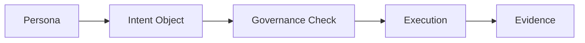

<!-- language-switch:start -->
[English](./README.md) | [中文](./README.zh-CN.md)
<!-- language-switch:end -->

# Agent Intent Protocol (AIP)

*Minimal semantic interaction objects for agent runtimes.*

Agent Intent Protocol (AIP) is a draft semantic interaction layer for the Digital Biosphere Architecture ecosystem. It defines machine-readable intent, action, and result objects that can pass between persona-oriented systems, governance checkpoints, runtimes, and audit layers.

AIP is not a transport protocol and not a full runtime framework. Its role is narrower: provide a compact object model for what an agent is trying to do, what action is proposed or taken, and what result is returned.

## Role in Digital Biosphere Architecture

AIP is the **Interaction Protocol Standard Entry**.

It defines the semantic exchange structure between agents.

## Architecture Position

AIP contributes the Interaction Layer in the Digital Biosphere Architecture ecosystem.

- POP handles persona identity.
- AIP handles task intent, action, and result exchange.
- Token Governor handles runtime constraints and policy.
- MVK handles execution integrity.
- ARO-Audit handles evidence and receipts.



## Non-goals

- AIP is not a chat format.
- AIP is not a transport layer.
- AIP is not a full agent orchestration framework.
- AIP is not an audit record format.
- AIP is not a permission or identity substitute.

## Core Objects

### Intent Object

An `agent_intent` object declares what the actor wants to achieve and under what constraints.

```json
{
  "schema_version": "0.1.0-draft",
  "object_type": "agent_intent",
  "intent": {
    "summary": "Find round-trip flight options from Shanghai to Singapore for next week"
  },
  "actor_ref": "pop://personas/travel-assistant",
  "constraints": {
    "max_budget_usd": 900,
    "approval_required": false
  }
}
```

### Action Object

An `agent_action` object declares a specific operation proposed or executed by the actor.

```json
{
  "schema_version": "0.1.0-draft",
  "object_type": "agent_action",
  "action": {
    "name": "call_search_tool",
    "summary": "Query the local flight-search adapter"
  },
  "actor_ref": "pop://personas/travel-assistant",
  "execution_mode": "proposal"
}
```

### Result Object

An `agent_result` object declares the status and references to outputs or evidence produced by the run.

```json
{
  "schema_version": "0.1.0-draft",
  "object_type": "agent_result",
  "status": "completed",
  "actor_ref": "pop://personas/travel-assistant",
  "correlation_id": "trip-search-001"
}
```

## Repository Layout

- `spec/` contains the draft protocol text.
- `schema/` contains JSON Schema drafts for the three core object types.
- `examples/` contains worked examples.
- `conformance/` contains valid and invalid fixtures.
- `scripts/validate_examples.py` validates the examples and fixtures.
- `tests/` contains a minimal pytest surface.

## Conformance

Run the lightweight validator:

```bash
python3 scripts/validate_examples.py
```

Run the minimal test surface:

```bash
pytest
```

## Status

- Working draft
- Semantic interaction layer only
- Intended to compose with POP, Token Governor, MVK, and ARO-Audit

## FDO-facing Note

For FDO-related positioning, see [docs/fdo-relation-note.md](docs/fdo-relation-note.md).

## Architecture Navigation

- [Digital Biosphere Architecture](https://github.com/joy7758/digital-biosphere-architecture)
- [Persona Object Protocol](https://github.com/joy7758/persona-object-protocol)
- [Agent Intent Protocol](https://github.com/joy7758/agent-intent-protocol)
- [Token Governor](https://github.com/joy7758/token-governor)
- [MVK](https://github.com/joy7758/fdo-kernel-mvk)
- [ARO Audit](https://github.com/joy7758/aro-audit)
